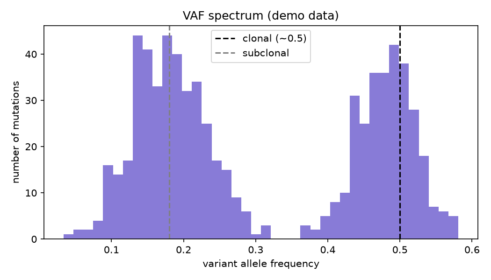

# Variant Allele Frequency Spectrum

A tumour is not one thing — it is a family tree of cell populations. The variant allele frequency spectrum is how you read that tree from a single sequencing sample.

## Why This Matters

Mutations present in every tumour cell (clonal, around 0.5 VAF in diploid regions) sit at a different frequency than those carried by only a subset (subclonal, lower VAF). The shape of the VAF histogram exposes the clonal architecture — central to understanding how a tumour evolves and develops resistance.

## How It Works

1. Compute VAF for each mutation as alt reads over total reads.
2. Histogram the VAFs.
3. Read off the clonal and subclonal peaks.

## What the Demo Shows



The demo simulates mutations with a clonal cluster near 0.5 and a subclonal cluster near 0.18. Both peaks are clearly visible — the signature of at least two distinct cell populations in one sample.

## Run It

```bash
pip install -r requirements.txt
python demo.py
```

> Demonstrated on synthetic data, so the whole thing is reproducible with no external downloads.
